# Modelo Entidad-Relación — Módulo Escucha Lite

**Motor:** PostgreSQL | **Base de datos:** `testimonios`  
**Esquemas:** `public`, `esclarecimiento`, `fichas`, `catalogos`

> Diagrama **semántico simplificado**: los tipos mostrados son los conceptuales (p. ej.
> `boolean` para banderas que en la BD son `INTEGER` 0/1) y se omiten columnas de auditoría
> legada y tablas de infraestructura (`jobs`, `failed_jobs`, `migrations`). La estructura
> real columna a columna está en [`www/diccionario_datos_generado.md`](www/diccionario_datos_generado.md).

---

## Diagrama ER (Mermaid)

```mermaid
erDiagram

    %% ─── SEGURIDAD Y USUARIOS ───────────────────────────────────────────────
    users {
        int id PK
        varchar name
        varchar email
        varchar password
        boolean is_login_directory_active
        timestamp created_at
        timestamp updated_at
    }

    rol {
        int id_nivel PK
        varchar nombre
        boolean es_sistema
        boolean habilitado
        int orden
    }

    rol_modulo_permiso {
        int id_permiso_rol PK
        int id_nivel FK
        varchar modulo
        boolean puede_ver
        boolean puede_crear
        boolean puede_editar
        boolean puede_eliminar
        boolean alcance_propias
        boolean alcance_dependencia
        boolean alcance_todas
    }

    entrevistador {
        int id_entrevistador PK
        int id_usuario FK
        int id_macroterritorio FK
        int id_territorio FK
        int id_dependencia_origen FK
        int numero_entrevistador
        int id_ubicacion FK
        int id_grupo FK
        int id_nivel FK
        boolean solo_lectura
        timestamp compromiso_reserva
        timestamp compromiso_acceso
    }

    compromiso_firma {
        int id PK
        int id_entrevistador FK
        varchar tipo
        varchar version_texto
        timestamp fecha_firma
        text texto_firmado
    }

    %% ─── EXPEDIENTE CENTRAL ──────────────────────────────────────────────────
    e_ind_fvt {
        int id_e_ind_fvt PK
        int id_entrevistador FK
        int id_macroterritorio FK
        int id_territorio FK
        varchar entrevista_codigo
        int entrevista_numero
        date entrevista_fecha
        int id_dependencia_origen FK
        int id_tipo_testimonio FK
        int id_idioma FK
        int entrevista_lugar FK
        int hechos_lugar FK
        text titulo
        boolean nna
        int tiempo_entrevista
        boolean es_virtual
        boolean id_activo
        boolean id_prioritario
        timestamp transcripcion_completada_at
        timestamp transcripcion_aprobada_at
        timestamp anonimizacion_completada_at
        jsonb metadatos_ce
        jsonb metadatos_ca
        jsonb metadatos_da
        jsonb metadatos_ac
        text html_transcripcion
        timestamp created_at
        timestamp updated_at
    }

    %% ─── ADJUNTOS ────────────────────────────────────────────────────────────
    adjunto {
        int id_adjunto PK
        int id_e_ind_fvt FK
        varchar ubicacion
        varchar nombre_original
        varchar tipo_mime
        int id_tipo FK
        bigint tamano
        varchar md5
        int duracion
        text texto_extraido
        timestamp texto_extraido_at
        boolean existe_archivo
    }

    %% ─── PROCESAMIENTO ───────────────────────────────────────────────────────
    asignacion_transcripcion {
        int id_asignacion PK
        int id_e_ind_fvt FK
        int id_adjunto FK
        int id_transcriptor FK
        int id_asignado_por FK
        int id_revisor FK
        varchar estado
        timestamp fecha_asignacion
        timestamp fecha_envio_revision
        timestamp fecha_revision
        text transcripcion_editada
        smallint calificacion_audio
        jsonb historial_comentarios
        int segundos_edicion_activa
    }

    asignacion_anonimizacion {
        int id_asignacion PK
        int id_e_ind_fvt FK
        int id_anonimizador FK
        int id_asignado_por FK
        int id_revisor FK
        varchar estado
        timestamp fecha_asignacion
        timestamp fecha_revision
        varchar tipos_anonimizar
        text texto_anonimizado
        int segundos_edicion_activa
    }

    trabajo_procesamiento {
        int id_trabajo PK
        int id_e_ind_fvt FK
        varchar tipo
        varchar estado
        int progreso
        jsonb parametros
        jsonb resultado
        timestamp iniciado_at
        timestamp completado_at
    }

    entidad_detectada {
        int id_entidad PK
        int id_e_ind_fvt FK
        varchar tipo
        text texto
        varchar texto_anonimizado
        int posicion_inicio
        int posicion_fin
        decimal confianza
        boolean verificado
        boolean excluir_anonimizacion
        boolean manual
    }

    %% ─── CONTENIDO ANALÍTICO ─────────────────────────────────────────────────
    contenido_testimonio {
        int id_contenido PK
        int id_e_ind_fvt FK
        date fecha_hechos_inicial
        date fecha_hechos_final
        text responsables_individuales
        text temas_abordados
        text otras_poblaciones_mencionadas
        text detalle_grupos_etnicos
        text otros_hechos_victimizantes
        text detalle_resistencias
    }

    %% ─── FICHAS DE PERSONA ───────────────────────────────────────────────────
    persona {
        int id_persona PK
        varchar nombre
        varchar apellido
        varchar nombre_identitario
        varchar alias
        int fec_nac_a
        int fec_nac_m
        int fec_nac_d
        int id_lugar_nacimiento FK
        int id_sexo FK
        int id_orientacion FK
        int id_identidad FK
        int id_etnia FK
        int id_rango_etario FK
        int id_discapacidad FK
        varchar num_documento
        int id_tipo_documento FK
        int id_nacionalidad FK
        int id_lugar_residencia FK
        varchar telefono
        varchar correo_electronico
        int id_edu_formal FK
        varchar profesion
        int id_actor_armado FK
        boolean organizacion_colectivo
        varchar nombre_organizacion
    }

    persona_entrevistada {
        int id_persona_entrevistada PK
        int id_persona FK
        int id_e_ind_fvt FK
        boolean es_victima
        boolean es_testigo
        boolean es_familiar
        int edad
        text sintesis_relato
    }

    %% Tabla real: fichas.entrevista (consentimiento e información de la entrevista)
    entrevista {
        int id_entrevista PK
        int id_e_ind_fvt FK
        int id_idioma FK
        boolean grabar_audio
        boolean grabar_video
        boolean tomar_fotografia
        boolean elaborar_informe
        boolean tratamiento_datos_analizar
        boolean tratamiento_datos_publicar
        boolean divulgar_material
        boolean restrictiva
        boolean borrable
    }

    consentimiento_informado {
        int id_consentimiento PK
        int id_persona_entrevistada FK
        boolean tiene_documento_autorizacion
        boolean es_menor_edad
        boolean autoriza_ser_entrevistado
        boolean permite_grabacion
        boolean permite_procesamiento_misional
        boolean permite_uso_conservacion_consulta
        boolean considera_riesgo_seguridad
        boolean autoriza_datos_personales_sin_anonimizar
        boolean autoriza_datos_sensibles_sin_anonimizar
        text observaciones
        text prueba_dano_derechos_privados
        text prueba_dano_nna
    }

    %% ─── PERMISOS DE ACCESO ──────────────────────────────────────────────────
    permiso {
        int id_permiso PK
        int id_entrevistador FK
        int id_e_ind_fvt FK
        int id_adjunto FK
        int id_tipo
        int id_estado
        timestamp fecha_otorgado
        timestamp fecha_vencimiento
        text justificacion
        int id_otorgado_por FK
        int id_revocado_por FK
        boolean es_solicitud
        varchar tipo_solicitud
        varchar estado_solicitud
        timestamp fecha_solicitud
        timestamp fecha_respuesta
        int id_respondido_por FK
        text motivo_rechazo
        date fecha_desde
        date fecha_hasta
    }

    %% ─── IMPORTACIÓN MASIVA ──────────────────────────────────────────────────
    importaciones_masivas {
        int id_importacion PK
        int id_usuario FK
        varchar nombre_archivo
        varchar ruta_csv
        varchar estado
        int total_expedientes
        int procesados
        int con_error
        jsonb configuracion
    }

    importacion_expedientes {
        int id_imp_expediente PK
        int id_importacion FK
        varchar id_csv
        int id_e_ind_fvt FK
        varchar estado
        jsonb datos_csv
        jsonb filas_originales
        jsonb archivos
        jsonb advertencias
        text error_mensaje
    }

    %% ─── CATÁLOGOS ───────────────────────────────────────────────────────────
    cat_cat {
        int id_cat PK
        varchar nombre
        varchar descripcion
        int editable
        int id_reclasificado FK
    }

    cat_item {
        int id_item PK
        int id_cat FK
        varchar descripcion
        varchar abreviado
        int orden
        int habilitado
        int id_reclasificado FK
    }

    criterio_fijo {
        int id_opcion PK
        int id_grupo
        varchar descripcion
        varchar abreviado
        int orden
        int habilitado
    }

    geo {
        int id_geo PK
        int id_padre FK
        int nivel
        varchar descripcion
        varchar codigo
        decimal lat
        decimal lon
    }

    %% ─── AUDITORÍA ───────────────────────────────────────────────────────────
    traza_actividad {
        bigint id_traza_actividad PK
        timestamp fecha_hora
        int id_usuario FK
        varchar accion
        varchar objeto
        int id_registro
        varchar referencia
        varchar ip
        int id_personificador FK
    }

    %% ═══════════════════════════════════════════════════════════════════════
    %% RELACIONES
    %% ═══════════════════════════════════════════════════════════════════════

    %% Seguridad
    rol ||--o{ rol_modulo_permiso : "tiene"
    users ||--o{ entrevistador : "tiene perfil"
    entrevistador ||--o{ compromiso_firma : "firma"

    %% Entrevistador ↔ geo y catálogos
    geo ||--o{ entrevistador : "macroterritorio / territorio / ubicacion"
    cat_item ||--o{ entrevistador : "dependencia / grupo"

    %% Expediente (tabla central)
    entrevistador ||--o{ e_ind_fvt : "crea"
    geo ||--o{ e_ind_fvt : "lugar entrevista / hechos / territorio"
    cat_item ||--o{ e_ind_fvt : "dependencia / tipo / idioma / area"

    %% Adjuntos
    e_ind_fvt ||--o{ adjunto : "tiene"
    cat_item ||--o{ adjunto : "tipo"

    %% Procesamiento
    e_ind_fvt ||--o{ asignacion_transcripcion : "tiene"
    adjunto ||--o{ asignacion_transcripcion : "es el archivo"
    entrevistador ||--o{ asignacion_transcripcion : "transcriptor"
    users ||--o{ asignacion_transcripcion : "asignado_por / revisor"

    e_ind_fvt ||--o{ asignacion_anonimizacion : "tiene"
    entrevistador ||--o{ asignacion_anonimizacion : "anonimizador"
    users ||--o{ asignacion_anonimizacion : "asignado_por / revisor"

    e_ind_fvt ||--o{ trabajo_procesamiento : "genera"
    e_ind_fvt ||--o{ entidad_detectada : "contiene"

    %% Contenido analítico (1:1)
    e_ind_fvt ||--|| contenido_testimonio : "tiene contenido"

    %% Consentimiento (1:1 por convención)
    e_ind_fvt ||--|| entrevista : "tiene consentimiento"

    %% Personas
    e_ind_fvt ||--o{ persona_entrevistada : "involucra"
    persona ||--o{ persona_entrevistada : "es"
    persona_entrevistada ||--o| consentimiento_informado : "tiene"

    geo ||--o{ persona : "lugar nacimiento / residencia"
    cat_item ||--o{ persona : "sexo / etnia / nacionalidad / etc"

    %% Permisos
    entrevistador ||--o{ permiso : "tiene permiso"
    e_ind_fvt ||--o{ permiso : "sujeto del permiso"
    adjunto ||--o{ permiso : "adjunto específico"
    users ||--o{ permiso : "respondido_por"

    %% Importación
    users ||--o{ importaciones_masivas : "crea"
    importaciones_masivas ||--o{ importacion_expedientes : "contiene"
    e_ind_fvt ||--o{ importacion_expedientes : "resultado"

    %% Catálogos
    cat_cat ||--o{ cat_item : "agrupa"
    cat_cat ||--o| cat_cat : "reclasificado_en"
    cat_item ||--o| cat_item : "reclasificado_en"
    geo ||--o{ geo : "padre → hijo"

    %% Auditoría
    users ||--o{ traza_actividad : "genera"
```



---

## Descripción de relaciones principales

### Núcleo del sistema

| Relación | Cardinalidad | Descripción |
|----------|-------------|-------------|
| `users` → `entrevistador` | 1:1 | Cada usuario tiene un perfil operativo de entrevistador (por convención de la aplicación; la BD no lo fuerza con UNIQUE) |
| `entrevistador` → `e_ind_fvt` | 1:N | Un entrevistador crea múltiples expedientes |
| `e_ind_fvt` → `adjunto` | 1:N | Un expediente puede tener múltiples archivos (audio, documentos, transcripciones) |
| `e_ind_fvt` → `contenido_testimonio` | 1:1 | Cada expediente tiene un único registro de contenido analítico (UNIQUE en BD) |
| `e_ind_fvt` → `fichas.entrevista` | 1:1 | Cada expediente tiene un único formulario de consentimiento (por convención; sin UNIQUE en BD) |

### Personas

| Relación | Cardinalidad | Descripción |
|----------|-------------|-------------|
| `persona` → `persona_entrevistada` | 1:N | Una persona puede ser entrevistada en múltiples expedientes |
| `e_ind_fvt` → `persona_entrevistada` | 1:N | Un expediente puede involucrar múltiples personas |
| `persona_entrevistada` → `consentimiento_informado` | 1:1 | Cada persona entrevistada tiene su consentimiento individual |

### Procesamiento

| Relación | Cardinalidad | Descripción |
|----------|-------------|-------------|
| `e_ind_fvt` → `asignacion_transcripcion` | 1:N | Un expediente puede tener múltiples asignaciones de transcripción (por cada adjunto de audio) |
| `adjunto` → `asignacion_transcripcion` | 1:N | Un archivo puede ser asignado a distintos transcriptores |
| `e_ind_fvt` → `entidad_detectada` | 1:N | El NER genera múltiples entidades por expediente |
| `e_ind_fvt` → `trabajo_procesamiento` | 1:N | Cada proceso automático (transcripción, NER) genera un trabajo |

### Permisos

| Relación | Cardinalidad | Descripción |
|----------|-------------|-------------|
| `entrevistador` → `permiso` | 1:N | Un entrevistador puede tener permisos sobre múltiples expedientes |
| `e_ind_fvt` → `permiso` | 1:N | Un expediente puede tener permisos para múltiples usuarios |

### Catálogos y geografía

Todas las tablas del sistema usan **claves foráneas a `cat_item`** para valores de listas controladas (sexo, etnia, tipo de testimonio, idioma, etc.) y **claves foráneas a `geo`** para referencias geográficas jerárquicas (país → departamento → municipio).

---

## Flujos de datos

### Flujo de creación de expediente

```
users ──→ entrevistador ──→ e_ind_fvt
                               ├──→ adjunto (audios)
                               ├──→ persona_entrevistada ──→ persona
                               │                         └──→ consentimiento_informado
                               ├──→ entrevista (consentimiento)
                               └──→ contenido_testimonio
```

### Flujo de procesamiento

```
e_ind_fvt + adjunto
    │
    ├──→ trabajo_procesamiento (transcripción automática)
    │         └──→ adjunto.texto_extraido actualizado
    │
    ├──→ trabajo_procesamiento (NER)
    │         └──→ entidad_detectada (registros por entidad)
    │
    ├──→ asignacion_transcripcion (revisión humana)
    │         └──→ adjunto tipo_313 (transcripción final)
    │
    └──→ asignacion_anonimizacion (revisión humana)
              └──→ adjunto tipo_314 (transcripción anonimizada)
```

### Flujo de permisos

```
entrevistador ──solicita──→ permiso (es_solicitud=true, estado_solicitud=pendiente)
                                │
                         Administrador revisa
                                │
                    ┌───────────┴───────────┐
              aprobado                  rechazado
         (id_estado=vigente)       (motivo_rechazo)
```

### Flujo de importación masiva

```
users ──→ importaciones_masivas (CSV subido)
              ├── estado: mapeando (configurar columnas)
              ├── estado: confirmado (usuario aprueba)
              ├── estado: procesando
              │       └──→ importacion_expedientes (por cada fila)
              │                   └──→ e_ind_fvt (creado)
              └── estado: completado / con_errores
```

---

## Esquemas y pertenencia

```
public
  └── users

esclarecimiento
  ├── rol
  ├── rol_modulo_permiso
  ├── entrevistador
  ├── e_ind_fvt                     ← TABLA CENTRAL
  ├── adjunto
  ├── asignacion_transcripcion
  ├── asignacion_anonimizacion
  ├── trabajo_procesamiento
  ├── entidad_detectada
  ├── contenido_testimonio
  ├── permiso
  ├── importaciones_masivas
  ├── importacion_expedientes
  ├── compromiso_firma
  └── tablas pivot (entrevista_formato, entrevista_modalidad, etc.)

fichas
  ├── persona
  ├── persona_entrevistada
  ├── entrevista              (consentimiento de la entrevista)
  ├── consentimiento_informado
  ├── persona_poblacion
  └── persona_ocupacion

catalogos
  ├── cat_cat
  ├── cat_item
  ├── criterio_fijo
  └── geo

(sin esquema / public)
  └── traza_actividad
```
